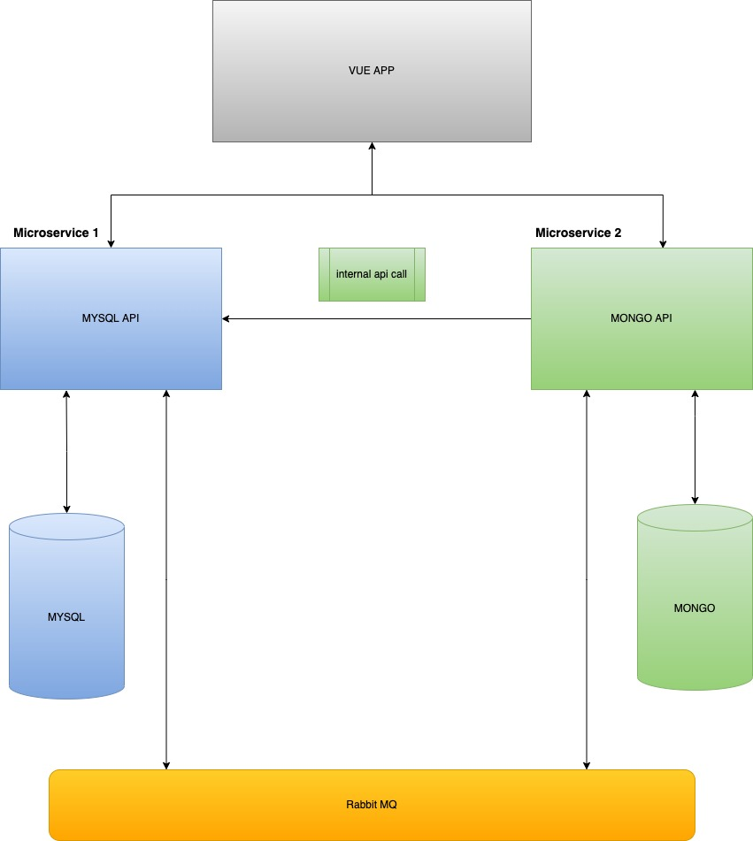

# crud-app

# Project Overview
This app interacts with 2 separate api's that have completely separate backends. I wanted to implement a microservice architecture with NestJs. Though the process was brutal I was able to consume data from both api's simultaneously and store the data in a way that allow both DB's to have the same product data even though they are structured differently. See the diagram below to for visual representation.

